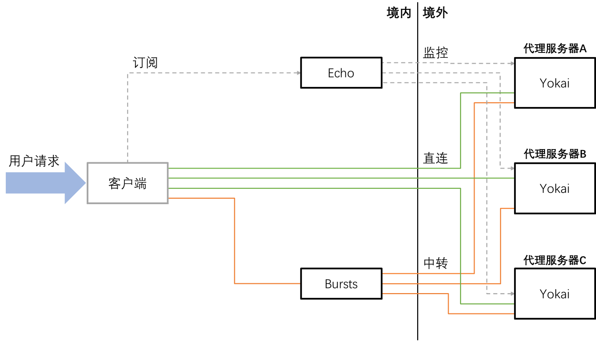
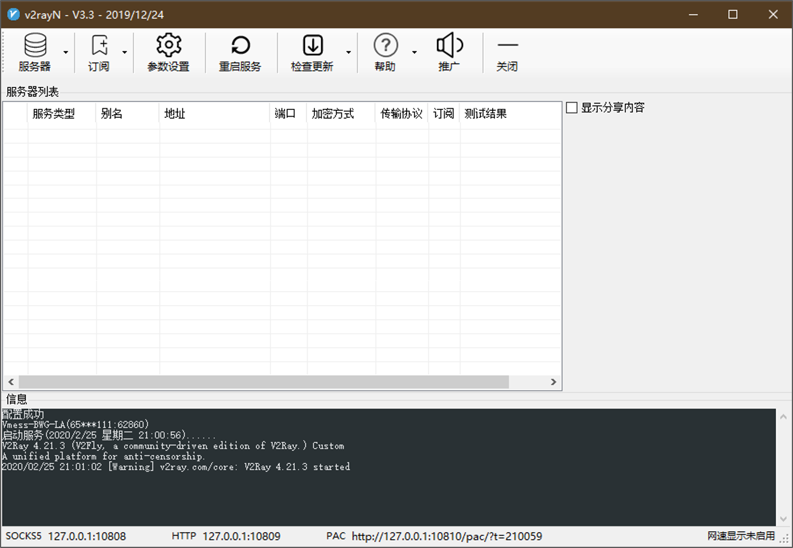
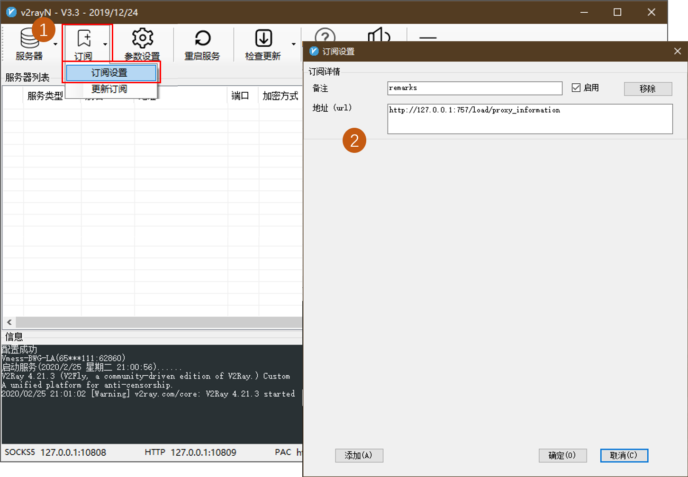
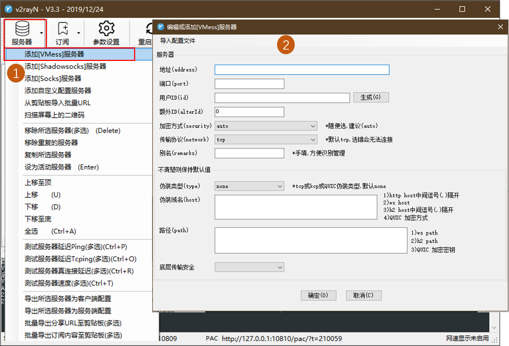
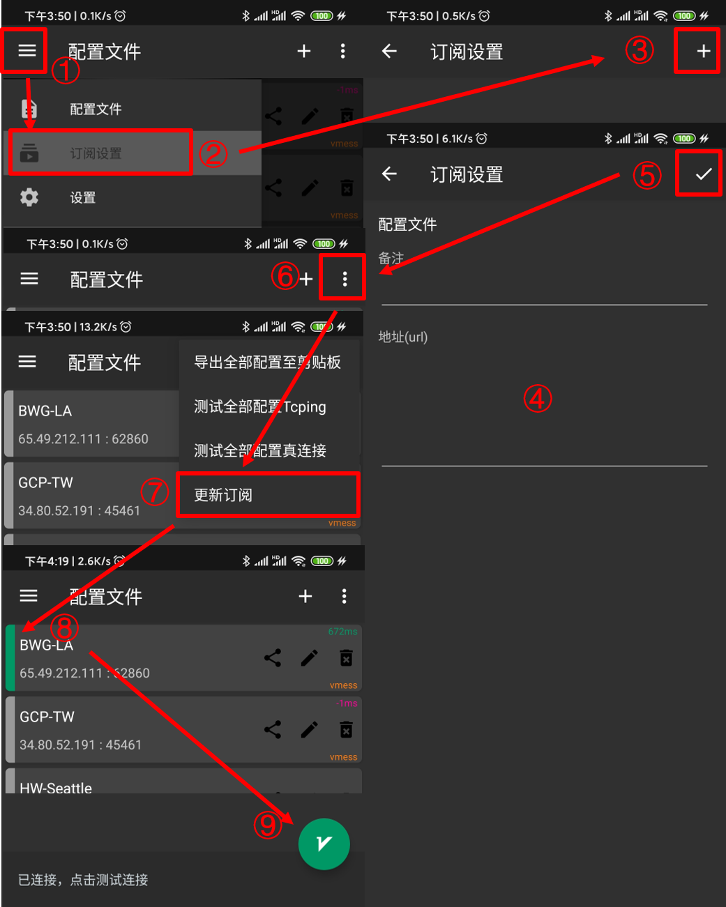
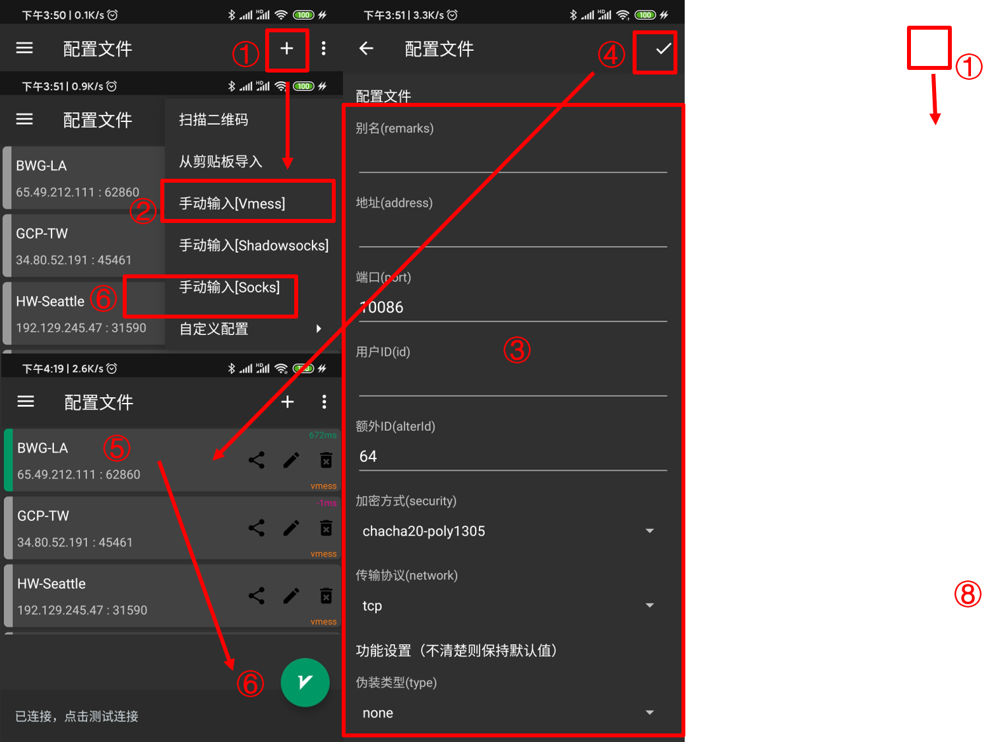
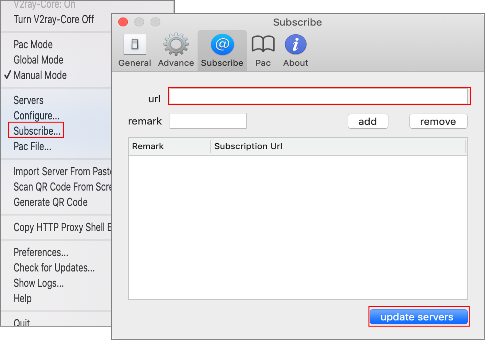
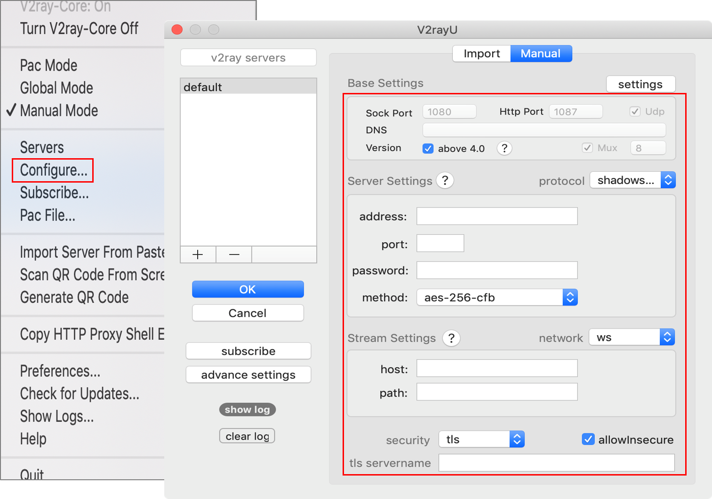
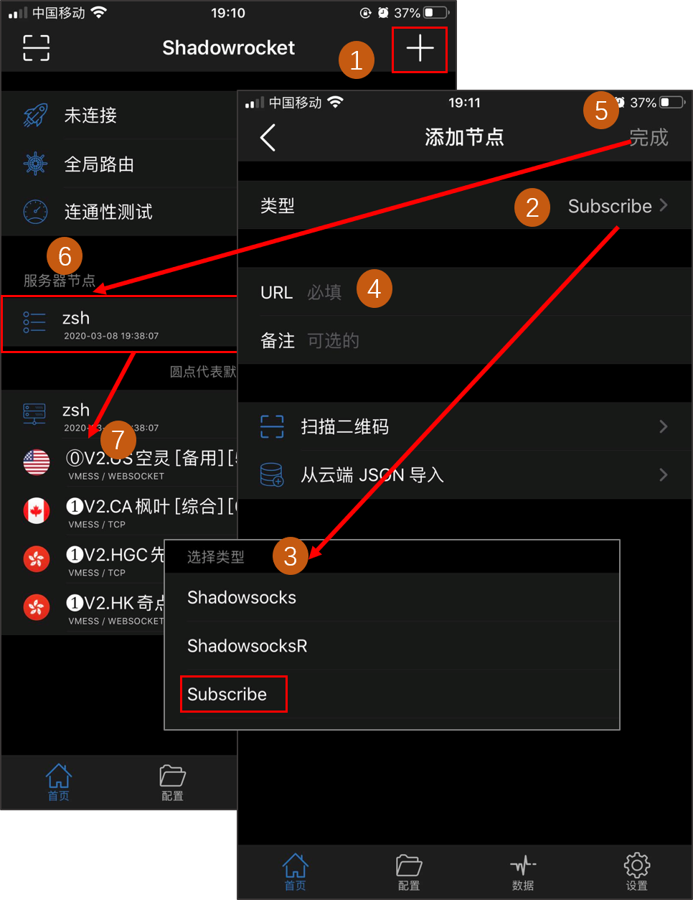
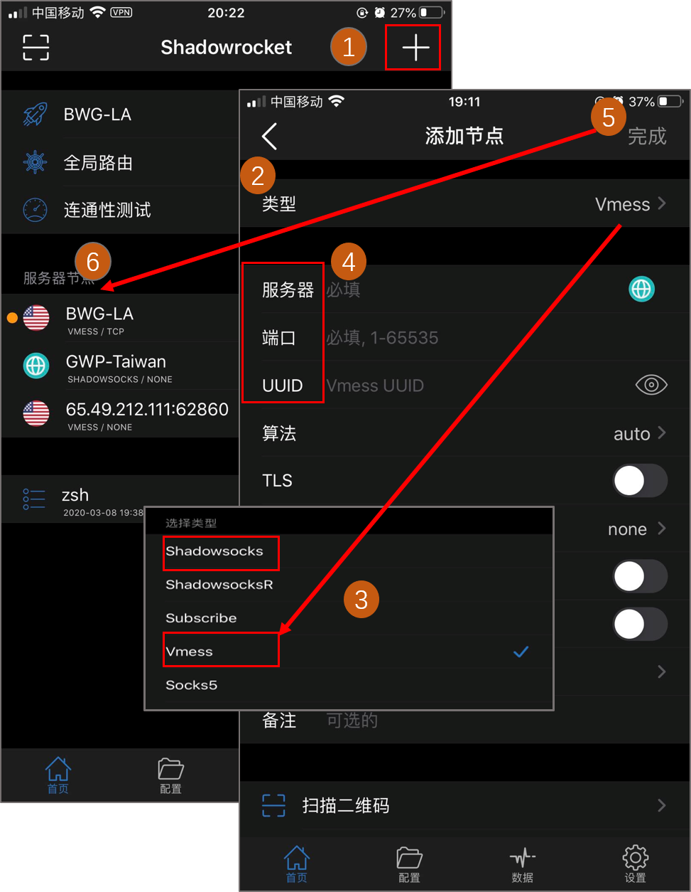

# Echo

- [Echo](#echo)
  - [简介](#简介)
  - [项目结构](#项目结构)
  - [接口文档](#接口文档)
  - [客户端使用说明](#客户端使用说明)
    - [windows客户端](#windows客户端)
      - [订阅代理](#订阅代理)
      - [手动添加单个代理](#手动添加单个代理)
    - [Android客户端](#android客户端)
      - [订阅代理](#订阅代理-1)
      - [手动添加单个代理](#手动添加单个代理-1)
    - [Mac客户端](#mac客户端)
      - [订阅代理](#订阅代理-2)
      - [手动添加单个代理](#手动添加单个代理-2)
    - [iOS客户端](#ios客户端)
      - [订阅代理](#订阅代理-3)
      - [手动添加单个代理](#手动添加单个代理-3)
    - [Linux客户端](#linux客户端)

## 简介

Echo项目是一个代理部署、管理、监控分发的平台，旨在为代理提供者提供快速部署代理并能远程监控和管理的能力；为代理使用者提供及时、高可用的代理订阅。

**Echo**取自育碧游戏《彩虹六号:围攻》中，特殊急袭部队(S.A.T.)成员[Echo](https://www.ubisoft.com/en-us/game/rainbow-six/siege/game-info/operators/echo),

其特殊能力为操控两台隐身无人机**妖怪**(`Yokai`)获取敌方信息，以及发射**超声波冲击**(`ultrasonic bursts`)瞬间瘫痪接触到的目标。

## 项目结构

项目包括：

- `Echo`: 代理管理面板，负责登记和管理代理信息，并持续监控；
- `Yokai`: 代理服务端，负责在服务器上快速部署代理和监控服务；
- `Bursts`: 代理中转服务，负责协同Echo，自动部署代理中转服务；

项目底层代理实现基于开源项目[`Project V`](https://www.v2ray.com)，支持`vmess`和`socks`协议。

## 接口文档

目前Echo没有Gui/Web界面，其API接口文档如下：

[接口文档](http://faii.com.cn:2525/Architecture/echorun/blob/master/%E6%8E%A5%E5%8F%A3%E6%96%87%E6%A1%A3.md)

## 客户端使用说明

任意平台支持`vmess`协议的客户端均可使用。

### windows客户端

[下载分流](http://faii.com.cn:2525/Architecture/echorun/raw/master/client/v2rayN.zip)

安装完成以后，点击系统托盘的V2RayN图标，弹出程序主界面：

使用方法如下：

#### 订阅代理

点击`订阅`下拉框的`订阅设置`，在弹框中点击`添加`，输入订阅网址，然后确定：

#### 手动添加单个代理

点`服务器`下拉菜单中的添加`vmess`服务器，出现下面的界面：

根据服务端信息填写服务器地址（域名或ip）、端口、用户id、额外id，加密方式一般都是auto，传输协议一般是tcp。别名可以自定义。

### Android客户端

[下载分流](http://faii.com.cn:2525/Architecture/echorun/raw/master/client/v2rayNG_1.1.14.apk)

使用方法如下:

#### 订阅代理

从配置管理中添加订阅地址，更新订阅，选中要使用的代理，点击右下角V字图标启动代理。

#### 手动添加单个代理

手动填写代理信息，加密方式不清楚选`auto`，没有伪装不要填写，完成后点击V字图标启动。

### Mac客户端

[下载分流](http://111.33.152.130:2525/Architecture/echorun/blob/master/client/V2rayU.dmg)

使用方法如下：

#### 订阅代理

点击状态栏V2rayU的图标，出现下拉主菜单，选择`Subscribe`，进入服务器配置界面：

填写订阅地址，点击`update servers`，更新/添加代理信息。

#### 手动添加单个代理

点击状态栏V2rayU的图标，下拉出现主菜单：选择`configure`，进入服务器配置界面，这里以添加`shadowsocks`服务器为例:

### iOS客户端

iOS没有开源客户端，推荐使用小火箭`Shadowrocket`，需使用美区账号安装。

使用方法如下:

#### 订阅代理

从配置管理中选择`Subcribe`类型，添加订阅地址，点击完成，更新订阅，选中要使用的代理即可。

#### 手动添加单个代理

手动填写代理信息，完成后选择服务器节点即可启动。

### Linux客户端

[下载分流](http://faii.com.cn:2525/Architecture/echorun/raw/master/client/v2ray-linux-64.zip)

v2ray官方程序不提供订阅功能，如有需要请自行寻找第三方解决方案。

使用方法如下:

下载解压，

复制Echo项目下`yokai/conf/client.json`文件，按格式修改`outbounds`的`vnext`部分。

如填写多个代理地址会采用轮询的方式连接各个代理。

将修改完成后的文件保存到本地，

执行命令`/{安装地址}/v2ray -config {你的client.json}`启动代理服务；

如需后台运行可执行命令`nohup /{安装地址}/v2ray -config {你的client.json} &`，或使用systemd或者supervisor等工具。

默认通过`socks`协议监听`127.0.0.1:1080`端口，为需要使用代理的服务配置代理地址即可使用。

eg：终端配置`export ALL_PROXY=socks5://127.0.0.1:1080`即可让终端命令行使用代理。
